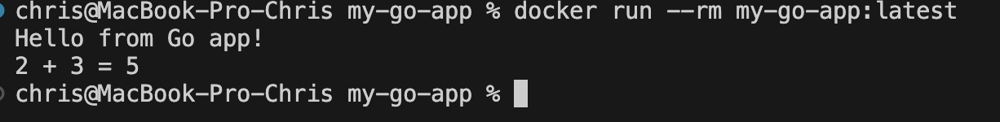

# Go CI/CD Pipeline App


Учебный проект для демонстрации настройки процессов непрерывной интеграции (CI) для приложения на **Go (Golang)** с использованием **GitHub Actions** и **Docker**.

## Содержание

- [Описание проекта](#описание-проекта)
- [Функционал CI/CD](#функционал-cicd)
- [Требования](#требования)
- [Структура проекта](#структура-проекта)
- [Запуск локально](#запуск-локально)
- [Тестирование](#тестирование)
- [Сборка Docker-образа](#сборка-docker-образа)
- [Лицензия](#лицензия)

## Описание проекта

Проект включает в себя базовое приложение на Go, покрытое тестами, и автоматизированный конвейер сборки. Пайплайн автоматически реагирует на добавление нового кода в репозиторий (push и pull request) и последовательно проверяет качество кода, прогоняет тесты и собирает Docker-образ.

## Функционал CI/CD

Пайплайн настроен в файле [`.github/workflows/ci.yml`](.github/workflows/ci.yml) и выполняет следующие шаги:

| № | Шаг | Описание |
|---|-----|----------|
| 1 | **Кэширование** | Настройка кэша для `go mod`, чтобы ускорить сборку |
| 2 | **Загрузка зависимостей** | Скачивание нужных модулей (`go mod download`) |
| 3 | **Линтинг кода** | Строгая проверка синтаксиса и стиля с помощью `golangci-lint` |
| 4 | **Тестирование** | Запуск тестов с проверкой покрытия кода (`coverage.out`) и сохранением артефактов в GitHub Actions |
| 5 | **Сборка Docker-образа** | Проверка успешной многоэтапной (multistage) упаковки приложения в минималистичный контейнер |

## Требования

- Go 1.22+
- Docker 24+
- `golangci-lint` (для локального линтинга)

## Структура проекта

```
.
├── .github/
│   └── workflows/
│       └── ci.yml          # Конфигурация пайплайна
├── cmd/                     # Точка входа приложения
├── internal/                # Внутренняя логика
├── Dockerfile                # Multistage-сборка образа
├── go.mod
├── go.sum
└── README.md
```

## Запуск локально

Установка зависимостей:

```bash
go mod download
```

Запуск приложения:

```bash
go run ./cmd/app
```

## Тестирование

Запуск тестов с проверкой покрытия:

```bash
go test ./... -coverprofile=coverage.out
```

Просмотр отчёта о покрытии в браузере:

```bash
go tool cover -html=coverage.out
```

Локальный запуск линтера (тот же, что используется в CI):

```bash
golangci-lint run ./...
```

## Сборка Docker-образа

Сборка проекта в Docker-образ:

```bash
docker build -t my-go-app:latest .
```

Запуск контейнера:

```bash
docker run --rm -p 8080:8080 my-go-app:latest
```
#

## Лицензия

Проект распространяется под лицензией MIT — см. файл [LICENSE](LICENSE).